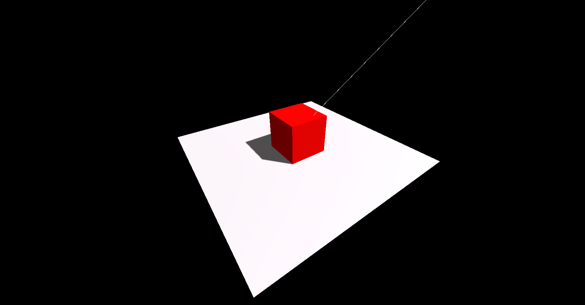

# Three-js Starter template

This template uses Webpack to serve modules and files.

## Usage: 
 - Open your Terminal / Powershell / CMD
 - Type ` npm i ` or ` yarn ` to install dependencies
 - Start Development server: ` npm run dev `  ` yarn run dev ` 
 - Start Building : ` npm run build `  ` yarn run build ` 

created by- [Devang Saklani](https://github.com/Devang47)